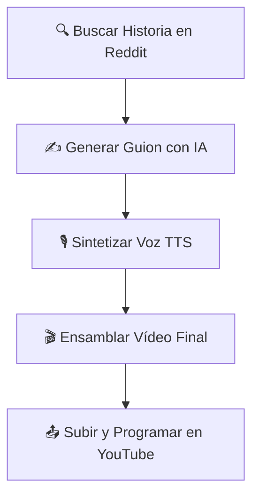

# Reditok 🤖 - Creador Autónomo de YouTube Shorts


**Reditok** es un sistema de automatización que transforma historias virales de Reddit en atractivos vídeos de YouTube Shorts. Gestiona todo el pipeline de producción de forma autónoma: desde la búsqueda de contenido hasta la publicación programada, creando un canal que se gestiona prácticamente solo.

---

## 🎯 Flujo de Producción

El bot opera en un ciclo continuo, siguiendo estos pasos para cada vídeo creado:



Además, un ciclo de mantenimiento se ejecuta automáticamente para asegurar que siempre haya vídeos de fondo disponibles, descargando y procesando nuevo material según sea necesario.

---

## ✨ Características Destacadas

| Característica | Descripción |
|----------------|-------------|
| 🧠 **Caza de Contenido Inteligente** | Analiza la "temperatura" de los subreddits para encontrar historias con el mayor potencial viral, basándose en la puntuación y actividad de los posts. |
| 🎯 **Optimización para Retención** | Subtítulos palabra por palabra con efecto karaoke, bordes de color y barra de progreso animada para mantener al espectador enganchado hasta el final. |
| 🗣️ **Voces Dinámicas** | Clonación de voz realista con Coqui TTS, utiliza diferentes muestras (masculinas/femeninas) para dar variedad y personalidad única a cada vídeo. |
| 🐳 **Despliegue Simplificado** | Completamente contenerizado con Docker. Despliegue consistente y sencillo en cualquier sistema operativo con un solo comando. |

---

## 🚀 Puesta en Marcha

### Prerrequisitos

- Git
- Docker
- Docker Compose

### Instalación

#### 1️⃣ Clonar el Repositorio

```bash
git clone https://github.com/izan-co/Reditok.git
cd Reditok
```

#### 2️⃣ Configurar Variables de Entorno

Copia la plantilla `.env.example` a un nuevo archivo `.env`. Este archivo contendrá tus secretos y nunca debe ser compartido.

```bash
cp .env.example .env
```

> 💡 **Importante**: Abre el archivo `.env` y completa tus credenciales para Reddit y Google Gemini. Las instrucciones detalladas están en el propio archivo.

#### 3️⃣ Preparar Assets

- **Muestras de Voz**: Coloca al menos un archivo de audio `.wav` en `assets/voice_samples/male/` y otro en `assets/voice_samples/female/`.
- **Credenciales de YouTube**: Descarga tu archivo `client_secret.json` desde Google Cloud Console y colócalo en la raíz del proyecto.

#### 4️⃣ Autorización de YouTube (Paso Único)

Ejecuta este comando para autorizar al bot a subir vídeos a tu canal.

```bash
docker-compose run --rm reditok python auth.py
```

Sigue las instrucciones en la terminal: copia la URL en tu navegador, inicia sesión y concede los permisos. Esto creará un archivo `token.json`.

#### 5️⃣ ¡Lanzar el Bot!

```bash
docker-compose up --build -d
```

El bot comenzará su ciclo de trabajo autónomo. Para ver los logs en tiempo real:

```bash
docker-compose logs -f
```

---

## 🤝 Contacto y Sugerencias

Este es un proyecto personal desarrollado de forma individual. Sin embargo, toda retroalimentación es bienvenida. Si tienes alguna sugerencia, encuentras un error o tienes una idea para una nueva característica, por favor, abre un issue en la [página de issues](https://github.com/izan-co/Reditok/issues) del proyecto.

---

## ⚠️ Disclaimer

Este proyecto fue creado con fines educativos y para la automatización de tareas personales. Es tu responsabilidad asegurarte de cumplir con los términos de servicio de Reddit y YouTube, así como de respetar los derechos de autor del contenido que utilices.

---

<div align="center">

**¿Te gusta el proyecto? ¡Dale una ⭐ en GitHub!**

[🐛 Reportar Bug](https://github.com/izan-co/Reditok/issues) • [✨ Solicitar Feature](https://github.com/izan-co/Reditok/issues)

</div>
